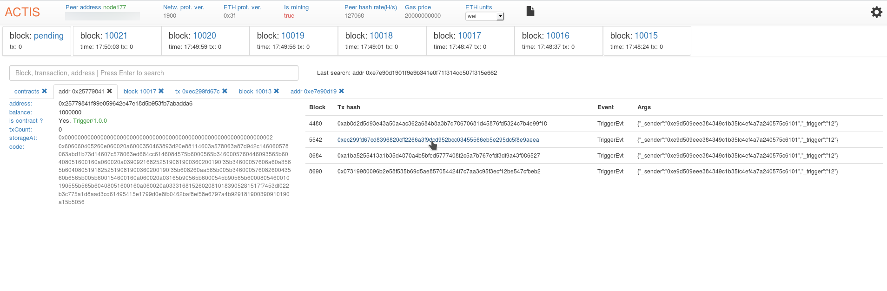

# Actis
Ethereum private blockchain monitoring tool. 
Benefits:
<ul>
  <li>No installation needed (only modern browser you should have), no any dependencies.</li>
  <li>Simple configuration.</li>
  <li>Show details about blocks, transactions, addresses.</li>
  <li>Show mined contracts.</li>
</ul>

Actis is Ethereum Dapp application that based on Web3.js.
